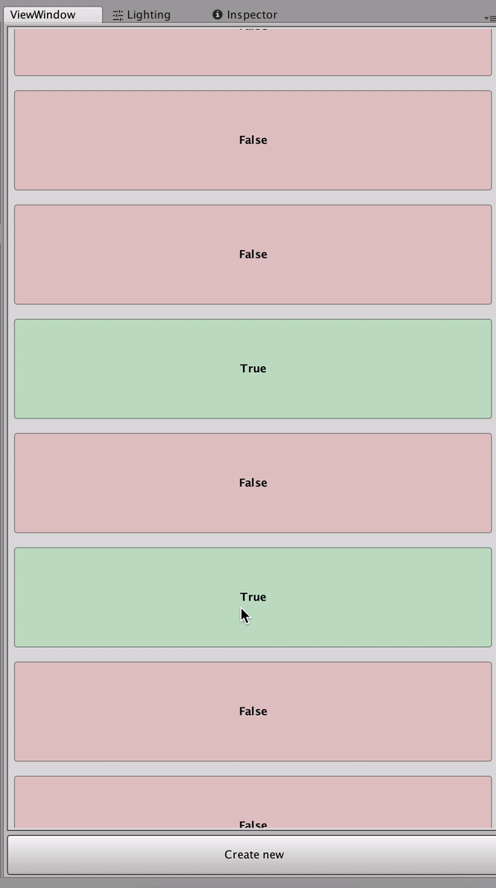

# Description

`Container` is a class with the looped doubly linked list of random bool values. You can get and change a value of the current element, move to the next element or the previous one. 

## Task

1) Create an algorithm to find a count of nodes in the list. After work of algorithm, all values should be the same to the first state.
2) Create a Unit Test for it.
3) Visualize looped list as infinite scroll view in the new window like it showed below.

All code must be optimal.
